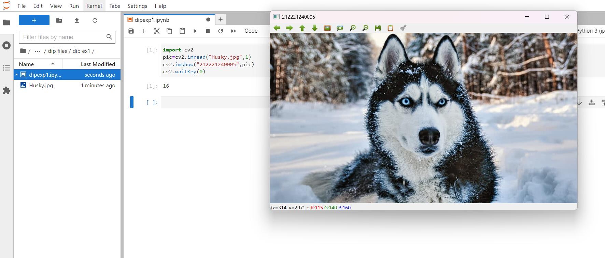
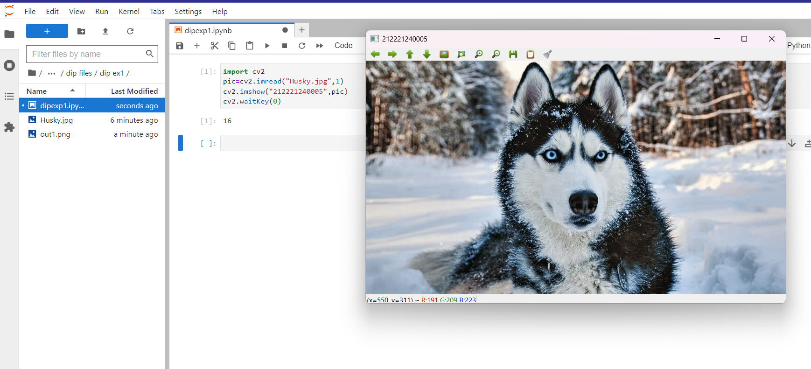
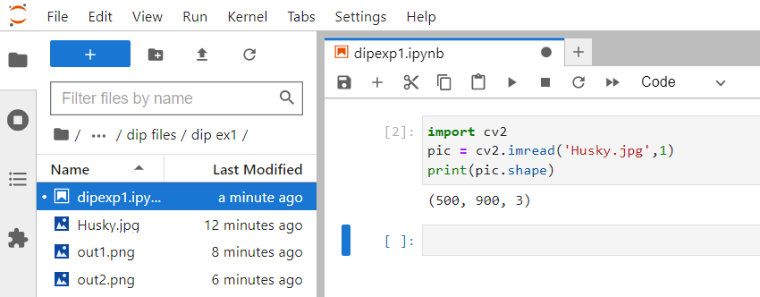
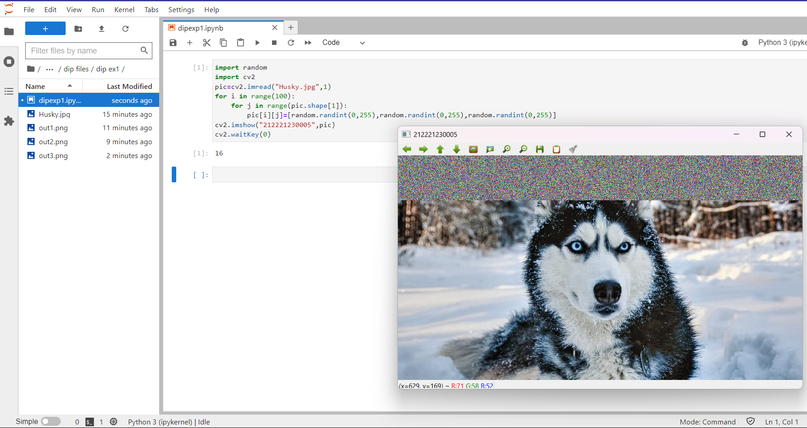

# READ AND WRITE AN IMAGE...

## AIM:

To write a python program using OpenCV to do the following image manipulations.

i) Read, display, and write an image.

ii) Access the rows and columns in an image.

iii) Cut and paste a small portion of the image.

## SOFTWARE REQUIRED:

Anaconda - Python 3.7

## ALGORITHM:

### STEP 1:

Choose an image and save it as a filename.jpg.

### STEP 2:

Use imread(filename, flags) to read the file.

### STEP 3:

Use imshow(window_name, image) to display the image.

### STEP 4:

Use imwrite(filename, image) to write the image.

### STEP 5:

End the program and close the output image windows.

## PROGRAM:

### Developed By: Anto Richard. S
### Register Number: 212221240005

i) # To Read,display the image:

```python
import cv2
pic=cv2.imread("Husky.jpg",1)
cv2.imshow("212221240005",pic)
cv2.waitKey(0)
cv2.destroyAllWindows()
```

ii) # To write the image:

```python
import cv2
pic=cv2.imread("Husky.jpg",1)
cv2.imshow("212221240005",pic)
cv2.waitKey(0)
cv2.destroyAllWindows()
```

iii) # Find the shape of the Image:

```python3
import cv2
pic = cv2.imread('Husky.jpg',1)
print(pic.shape)
```

iv) # To access rows and columns:

```python3
import random
import cv2
pic=cv2.imread("Husky.jpg",1)
for i in range(100):
    for j in range(pic.shape[1]):
        pic[i][j]=[random.randint(0,255),random.randint(0,255),random.randint(0,255)]
cv2.imshow("212221230005",pic)
cv2.waitKey(0)
cv2.destroyAllWindows()
```

v) # To cut and paste portion of image:

```python3
import cv2
pic=cv2.imread("Husky.jpg",1)
crop=pic[300:400,300:400]
pic[50:150,50:150]=crop
cv2.imshow("212221240005",pic)
cv2.waitKey(0)
cv2.destroyAllWindows()
```

## OUTPUT:

### i) Read and display the image:



### ii) Write the image:



### iii) Shape of the Image:



### iv) Access rows and columns:



### v) Cut and paste portion of image:


## RESULT:

Thus the images are read, displayed, and written successfully using the python programming.
